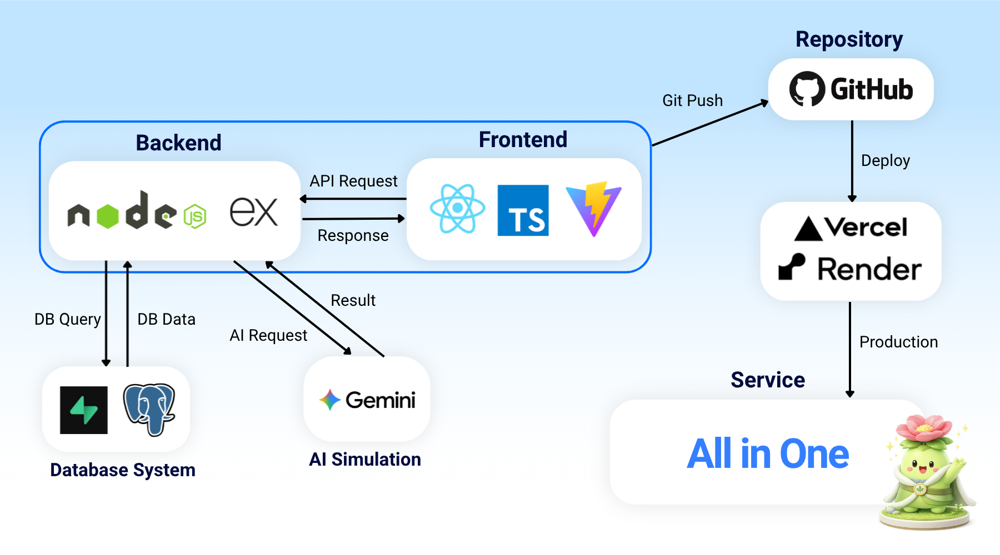
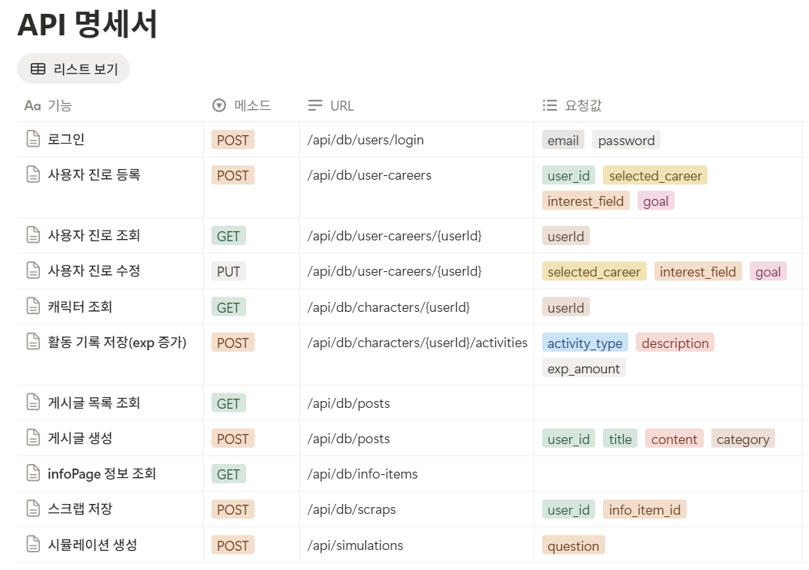
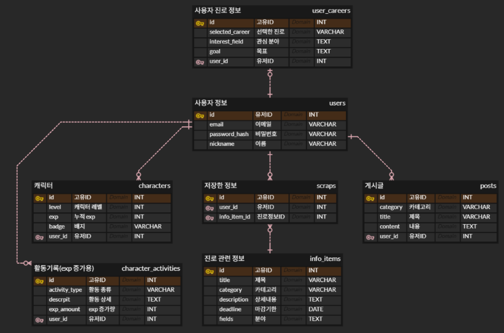

# 🌱 All in One

> 진로 시뮬레이션과 캐릭터 성장을 중심으로 사용자의 진로 탐색 과정을 이어가는 통합 진로 성장 플랫폼
>
> ❝ 막막한 진로 고민을, 하나의 성장 과정으로 ❞
>
> **흩어진 진로 정보를 찾는 데서 끝나지 않고, 직접 선택하고 기록하며 성장하는 서비스입니다.**

---

## 팀원 소개

| 이름 | 역할 | 담당 |
| --- | --- | --- |
| 김동현 | Frontend | UI 디자인 및 화면 구성, 발표 |
| 최단비 | Frontend | 프론트엔드 기능 구현 및 API 연결 |
| 유서진 | Backend | 데이터베이스 설계 및 API 구현, 발표 |
| 우효정 | Backend | AI 연동 및 서비스 로직 구현 |

---

## 서비스 소개

All in One은 진로 탐색 과정에서 필요한 여러 요소를 하나의 웹 서비스 안에 모은 플랫폼입니다.

사용자는 진로 시뮬레이션을 통해 특정 상황에서 어떤 선택을 할지 고민해볼 수 있고, 선택 결과에 대한 AI 응답을 확인할 수 있습니다. 또한 진로 정보 페이지를 통해 필요한 정보를 탐색하고, 커뮤니티에서 다른 사용자와 고민이나 경험을 공유할 수 있습니다.

서비스 이용 과정에서 쌓이는 출석, 활동 기록, 시뮬레이션 참여 등은 캐릭터 성장 요소와 연결됩니다. 이를 통해 진로 탐색을 일회성 검색이 아니라, 사용자가 꾸준히 참여하고 자신의 변화를 확인할 수 있는 경험으로 바꾸는 것을 목표로 합니다.

---

## 개발 배경

진로를 탐색하는 과정은 생각보다 복잡합니다.  
관심 있는 분야를 찾아보고, 관련 정보를 검색하고, 주변 사람들의 경험을 참고하며 자신의 방향을 정해야 합니다.

All in One은 다음과 같은 문제의식에서 출발했습니다.

- 진로 정보, 취업 정보, 대외활동 정보가 여러 곳에 흩어져 있어 필요한 정보를 찾기 불편함
- 어떤 선택을 해야 할지 구체적으로 판단하기 어려움
- 단순 정보 탐색만으로는 지속적인 동기 부여가 부족함

## 프로젝트 목표

- AI 시뮬레이션을 통한 진로 선택 부담 완화
- 캐릭터 성장을 통한 성취감 있는 진로 탐색 경험 제공
- 흩어진 진로 정보를 한곳에서 확인할 수 있는 통합 서비스 제공

---

## 서비스 핵심 흐름

All in One의 사용 흐름은 다음과 같습니다.

```text
회원가입 / 로그인
        ↓
홈 화면에서 주요 기능 진입
        ↓
진로 시뮬레이션 또는 정보 탐색
        ↓
커뮤니티 활동 및 출석 체크
        ↓
활동 기록 누적
        ↓
캐릭터 경험치 및 성장 상태 반영
```

서비스의 중심은 **진로 시뮬레이션**과 **캐릭터 성장**입니다.  
시뮬레이션은 사용자가 진로 선택을 능동적으로 경험하게 만들고, 캐릭터 성장은 그 경험이 계속 쌓이고 있다는 점을 시각적으로 보여줍니다.

---

## 주요 기능

### 1. AI 기반 진로 선택 시뮬레이션

All in One의 핵심 AI 기능은 사용자가 두 가지 진로 선택지 사이에서 고민할 때, 각 선택지를 비교하고 이후의 방향을 구체화할 수 있도록 돕는 **진로 선택 시뮬레이션**입니다.

사용자는 “공모전을 준비할지, 자격증을 준비할지”, “개발 직무를 준비할지, 기획 직무를 준비할지”처럼 실제 진로 과정에서 마주할 수 있는 두 가지 선택지를 입력합니다. 이후 AI는 각 선택지의 장단점, 선택했을 때 예상되는 흐름, 종합적인 조언, 그리고 선택 이후 실천할 수 있는 시뮬레이션 로드맵을 제공합니다.

```text
사용자 고민 입력
↓
두 가지 선택지 전달
↓
Frontend에서 선택값을 Backend로 전달
↓
Backend에서 진로 상황 기반 프롬프트 구성
↓
Gemini API 요청
↓
선택지별 장단점 / 종합 조언 / 로드맵 생성
↓
시뮬레이션 결과 화면 출력
```

All in One의 AI 기능은 사용자가 막연하게 느끼던 진로 고민을 구체적인 비교 대상으로 바꾸는 데 초점을 두고 있습니다.

각 선택이 가질 수 있는 장점과 부담, 이후 필요한 준비 과정을 함께 제시함으로써 사용자는 선택의 부담을 줄이고, 자신의 상황에 맞는 방향을 더 명확하게 판단할 수 있습니다. 또한 선택 이후 필요한 행동과 과정을 구체적인 로드맵으로 확인할 수 있습니다.

### 2. 캐릭터 성장 시스템

사용자의 진로 관련 활동을 통해 경험치를 얻고 캐릭터를 성장시킬 수 있습니다.

- 출석 체크 (+5exp)
- 진로 시뮬레이션 참여 (+15exp)
- 정보 페이지 탐색 및 정보 저장(+5exp)
- 커뮤니티 활동 (+5exp)
- 프로필 및 캐릭터 상태 확인

이러한 캐릭터 성장 시스템은 사용자가 진로 탐색 과정을 지속적으로 수행하도록 동기를 부여하며, 사용자는 진로 탐색 과정에서 자신의 노력과 성취를 캐릭터의 변화를 통해 시각적으로 확인할 수 있습니다.

캐릭터는 단순한 장식 요소가 아니라, 사용자의 활동과 진로 탐색 서비스 이용 정도를 보여주는 성장 지표로서 사용자에게 성취감을 제공하고 꾸준한 참여를 유도하는 역할을 합니다.

### 3. 진로 정보 제공

정보 페이지에서는 사용자의 진로 탐색과 준비 과정에 필요한 다양한 정보를 한 곳에서 확인할 수 있도록 제공합니다.

사용자는 정보 페이지에서 원하는 정보를 카테고리별로 탐색할 수 있으며, 검색 기능을 통해 특정 키워드와 관련된 정보를 빠르게 찾을 수 있습니다. 또한 관심 있는 정보는 저장할 수 있어, 이후 다시 찾아보거나 준비 과정에서 참고할 수 있습니다.

현재 제공되는 정보는 다음과 같습니다.

- 공모전 정보
- 시험 및 자격증 정보
- 인턴십 정보
- 대외활동 정보

정보 페이지의 기능은 다음과 같습니다.

- **카테고리별 정보 정렬**  
  사용자는 공모전, 시험, 자격증, 인턴십, 대외활동 등 원하는 카테고리를 선택하여 필요한 정보만 분류해서 확인할 수 있습니다.

- **검색**  
  제목, 분야, 기관명, 설명 등의 키워드를 기준으로 정보를 검색할 수 있습니다. 이를 통해 사용자는 전체 목록을 하나씩 확인하지 않아도 필요한 정보를 빠르게 찾을 수 있습니다.

- **관심 정보 저장**  
  사용자는 나중에 다시 보고 싶은 정보를 저장할 수 있습니다. 저장된 정보는 이후 진로 준비 과정에서 다시 확인하거나 참고할 수 있습니다.

현재 정보 데이터는 Supabase에 저장된 데이터를 기반으로 관리됩니다.  
프론트엔드는 Supabase에 저장된 정보를 불러와 카테고리별 목록, 검색 결과, 저장 내역 화면에 출력합니다.

```text
정보 데이터 저장(supabase DB에서 직접 관리)
↓
Frontend에서 정보 목록 요청
↓
카테고리 / 검색 조건에 따라 정보 필터링
↓
정보 카드 목록 출력
↓
진로 정보 저장 기능
```

초기 버전에서는 서비스 측에서 직접 정리한 데이터를 Supabase에 저장하여 제공합니다. 이후에는 공공데이터 API, 채용·공모전 관련 Open API, 크롤링, 관리자 등록 기능 등을 활용해 정보를 더 자동화된 방식으로 수집하고 갱신할 수 있습니다.

이를 통해 All in One은 단순히 정보를 나열하는 페이지가 아니라, 사용자가 진로 선택 이후 필요한 기회와 준비 자료를 효율적으로 탐색할 수 있는 정보 허브 역할을 합니다.

## 부가 기능

### 1. 커뮤니티

커뮤니티는 비슷한 진로를 고민하는 사용자들이 진로 고민이나 정보를 공유하며 소통할 수 있는 공간입니다.

예시 게시글 유형은 다음과 같습니다.

- 진로 고민 상담
- 스터디 모집
- 프로젝트 팀원 모집
- 취업 준비 관련 질문
- All in One 사용 팁
- 대외활동 또는 경험 공유

진로 탐색 과정에서는 개개인 간의 정보 격차가 크고 혼자 진로 방향을 설정하기 어려운 경우가 많기 때문에, 다른 사용자의 경험과 조언은 사용자에게 실질적인 도움을 제공합니다. 이를 통해 사용자는 자신의 진로 방향을 보다 구체적으로 설정하고 계획을 구체화 할 수 있습니다.

All in One은 커뮤니티 기능을 통해 사용자 간 연결을 강화하고, 단순히 정보를 제공하는 서비스를 넘어 함께 성장하는 사용자 참여 중심 플랫폼으로 확장될 수 있도록 구성했습니다.

### 2. 출석 및 활동 기록 저장

출석 기능은 사용자의 재방문을 유도하고, 진로 탐색 활동 기록은 캐릭터 성장 시스템과 연결됩니다.

- 출석 여부 저장
- 활동 내역 관리
- 경험치 또는 성장 상태 반영
- 사용자의 서비스 참여 흐름 확인

단순히 사용자의 접속 여부를 기록하는 기능을 넘어, 사용자의 꾸준한 참여와 성취 정도를 시각적으로 보여주는 서비스의 성장 구조와 연결되는 부가 기능입니다.

### 3. 프로필 및 캐릭터 화면

프로필 화면에서는 사용자 정보와 활동 상태를 확인할 수 있습니다.  
캐릭터 화면에서는 현재 캐릭터의 성장 단계, 경험치, 레벨 등의 정보를 확인할 수 있습니다.

캐릭터의 성장과 변화를 통해 사용자는 자신의 진로 탐색 과정을 직관적으로 볼 수 있습니다.

---

## 화면 구성

All in One은 모바일 환경을 중심으로 화면을 구성했습니다.

| 화면 | 역할 |
| --- | --- |
| Login Page | 기존 사용자 로그인 |
| Signup Page | 신규 사용자 회원가입 |
| Home Page | 주요 기능으로 이동하는 메인 화면 |
| Simulation Page | 선택 기반 진로 시뮬레이션 진행 |
| Info Page | 진로 관련 정보 목록 확인 및 저장 |
| Community Page | 게시글 작성 및 조회 |
| Attendance Page | 출석 체크 및 활동 기록 연결 |
| Character Page | 캐릭터 성장 상태 확인 |
| Profile Page | 사용자 정보 및 저장 정보 확인 |

각 화면은 하나의 기능을 명확히 수행하도록 분리했으며, 사용자가 복잡한 메뉴 구조 없이 주요 기능에 접근할 수 있도록 설계했습니다.

---

## 주제 선정 키워드 반영

### 1. 꿈

- 사용자가 설정한 진로, 관심 분야, 목표를 바탕으로 앞으로의 성장 방향 구체화
- AI 진로 시뮬레이션을 통해 선택지별 장점, 주의점, 준비 과정, 로드맵 제공

### 2. 연결

- 흩어진 진로 정보, 커뮤니티 소통, 활동 기록을 하나의 서비스 흐름으로 통합
- 사용자 활동 데이터를 캐릭터 성장과 개인별 정보 관리로 연결하여 지속적인 진로 준비 경험 제공

### 3. 경계

- 취업과 대학원, 복수전공과 전공심화처럼 사용자가 진로 선택 과정에서 마주하는 갈림길을 구체화
- AI 시뮬레이션과 커뮤니티 정보를 통해 각 선택지의 장단점, 주의점, 준비 요소를 비교하며 상황에 맞는 선택 지원

### 4. 과잉

- 공모전, 자격증, 인턴, 시험처럼 진로 선택에 필요한 정보가 너무 많아 오히려 방향을 정하기 어려운 상태
- All in One은 흩어진 정보를 한곳에 모아 사용자가 빠르게 탐색할 수 있도록 지원
- 검색·스크랩·AI 시뮬레이션을 통해 정보 과잉 속에서도 선택 기준과 준비 방향 정리

### 5. 불편

- 여러 사이트를 오가며 진로 정보를 찾고 따로 저장해야 하는 번거로움
- All in One은 시뮬레이션, 정보 조회, 스크랩, 커뮤니티를 한곳에 모아 진로 준비 과정 간소화

---

## 기술 스택

- Frontend : React, TypeScript, Vite
- Styling : CSS / Tailwind CSS
- Backend : Node.js, Express
- Database : Supabase, PostgreSQL
- AI : Gemini API
- Deploy : Vercel / Render

## 시스템 구조

```text
Frontend
React + TypeScript + Vite
        │
        │ API Request / Response
        ▼
Backend API Server
Node.js + Express
        │
        ├── Supabase + PostgreSQL
        │       └── 사용자, 게시글, 정보, 출석, 캐릭터 데이터 관리
        │
        └── Gemini API
                └── 진로 시뮬레이션 응답 생성
```

### 서비스 아키텍처



### 데이터 흐름

1. 사용자가 프론트엔드 화면에서 기능을 실행합니다.
2. 프론트엔드는 필요한 데이터를 백엔드 API로 요청합니다.
3. 백엔드는 요청 목적에 따라 Supabase에서 데이터를 조회하거나 저장합니다.
4. 진로 시뮬레이션 요청의 경우, 백엔드가 Gemini API에 요청을 보내고 응답을 가공합니다.
5. 최종 결과는 다시 프론트엔드로 전달되어 화면에 표시됩니다.

데이터베이스 조회와 저장은 백엔드가 담당하고, AI는 백엔드가 구성한 요청에 따라 시뮬레이션 응답을 생성하는 역할을 합니다.

---

## 레포지토리 및 배포

### GitHub Repository

Frontend + Backend 통합 레포지토리

🌐 [All in One Repository](https://github.com/skeltx44/All-in-One.git)

### 배포

- Frontend: Vercel 배포
- Backend: Render 배포
- Database: Supabase 프로젝트 사용

[서비스 바로가기](all-in-one-seven-ashy.vercel.app)

---

## Frontend

### 1. 페이지 단위 기능 구현

- React Router 기반 화면 라우팅 구성
- 로그인 / 회원가입 / 홈 / 시뮬레이션 / 정보 / 커뮤니티 / 출석 / 캐릭터 / 프로필 페이지 분리
- 페이지별 핵심 기능 중심 구현
- 사용자 입력 및 버튼 동작과 백엔드 API 연결

### 2. 모바일 중심 화면 구성

- 모바일 사용 환경을 기준으로 한 화면 설계
- 공통 레이아웃 및 하단 네비게이션 적용
- 카드형 UI, 둥근 버튼, 간결한 목록 구조 활용
- 주요 기능에 빠르게 접근할 수 있는 화면 구성

### 3. 캐릭터 성장 UI 구현

- 사용자 활동에 따른 캐릭터 성장 상태 표시
- 캐릭터 이미지, 레벨, 경험치 바 구성
- 출석 / 시뮬레이션 / 정보 저장 / 커뮤니티 활동 경험치 반영
- 레벨 변화에 따른 캐릭터 이미지 전환

```text
frontend/
├── public/
│   └── characters/                 # 캐릭터 성장 단계별 이미지 저장 폴더
│       ├── level1.png              # 1단계 캐릭터 이미지
│       ├── level2.png              # 2단계 캐릭터 이미지
│       └── level3.png              # 3단계 캐릭터 이미지
│
├── src/
│   ├── App.tsx                     # 전체 라우팅 구조를 정의하는 최상위 컴포넌트
│   ├── main.tsx                    # React 애플리케이션 진입점
│   ├── index.css                   # 전역 스타일 및 기본 CSS 설정
│   ├── vite-env.d.ts               # Vite 환경 타입 선언 파일
│   │
│   ├── pages/                      # 서비스의 주요 화면 단위 페이지 모음
│   │   ├── StartPage.tsx           # 서비스 시작 화면
│   │   ├── LoginPage.tsx           # 로그인 화면
│   │   ├── SignupPage.tsx          # 회원가입 화면
│   │   ├── HomePage.tsx            # 메인 홈 화면
│   │   ├── SimulationPage.tsx      # AI 기반 진로 시뮬레이션 화면
│   │   ├── InfoPage.tsx            # 진로 정보 목록 및 상세 정보 화면
│   │   ├── CommunityPage.tsx       # 커뮤니티 게시글 목록 및 작성 화면
│   │   ├── AttendancePage.tsx      # 출석 체크 및 활동 기록 화면
│   │   ├── CharacterPage.tsx       # 캐릭터 성장 상태 확인 화면
│   │   └── ProfilePage.tsx         # 사용자 프로필 및 활동 상태 화면
│   │
│   ├── components/                 # 여러 페이지에서 재사용되는 컴포넌트 모음
│   │   ├── common/                 # 서비스 공통 기능 컴포넌트
│   │   │   ├── Character.tsx       # 캐릭터 이미지를 화면에 표시하는 컴포넌트
│   │   │   ├── ExpBar.tsx          # 사용자 경험치 진행 상태를 보여주는 바 컴포넌트
│   │   │   ├── MenuCard.tsx        # 홈 화면 등에서 사용하는 메뉴 카드 컴포넌트
│   │   │   ├── useExpToast.tsx     # 경험치 획득 안내 토스트를 처리하는 커스텀 훅
│   │   │   └── useLevelUpModal.tsx # 레벨업 안내 모달을 처리하는 커스텀 훅
│   │   │
│   │   └── layout/                 # 전체 화면 레이아웃 관련 컴포넌트
│   │       ├── BottomNav.tsx       # 하단 네비게이션 바 컴포넌트
│   │       └── Layout.tsx          # 공통 레이아웃을 감싸는 컴포넌트
│   │
│   └── lib/                        # API 요청 및 공통 유틸 함수 모음
│       ├── addActivity.ts          # 사용자 활동 기록 및 경험치 반영 관련 함수
│       ├── api.ts                  # 백엔드 API 요청 설정 및 호출 함수
│       └── utils.ts                # 공통 유틸리티 함수
│
├── index.html                      # Vite 애플리케이션의 HTML 진입 파일
├── package.json                    # 프론트엔드 의존성 및 실행 스크립트 설정
├── tsconfig.json                   # TypeScript 컴파일 설정
├── vite.config.ts                  # Vite 개발 서버 및 빌드 설정
└── postcss.config.mjs              # PostCSS 스타일 처리 설정
```

## Backend

### API 명세서

[API 및 기능 명세서](https://zigzag-primrose-bfd.notion.site/36efdbe4a90a80ce88e9fbe4148ffe02?v=36efdbe4a90a80e0b5ca000cd58e5c5b)



---

### ERD



---

### 1. Express 기반 API 서버 구성

- Node.js + Express 기반 백엔드 서버 구성
- `server.js` 중심의 서버 실행 및 라우터 연결
- 사용자 / 캐릭터 / 진로 정보 / 커뮤니티 / 스크랩 / 시뮬레이션 API 분리
- 프론트엔드 요청에 따른 DB 조회 및 외부 API 연동 처리

### 2. 사용자 인증 및 진로 정보 관리

- 회원가입 및 로그인 API 구현
- 사용자 정보의 Supabase PostgreSQL 저장 및 조회
- 사용자 ID 기반 진로, 관심 분야, 목표 데이터 관리
- 프로필 / 캐릭터 / 커뮤니티 / 정보 저장 기능과 사용자 데이터 연결

### 3. AI 진로 시뮬레이션 API 구현

- 사용자가 입력한 두 가지 진로 선택지 수신
- 선택지 비교에 맞춘 Gemini API 프롬프트 구성
- 장단점 / 종합 조언 / 시뮬레이션 로드맵 응답 생성
- Gemini API Key의 백엔드 환경변수 관리

### 4. 서비스 데이터 및 활동 기록 처리

- 진로 정보 / 스크랩 / 게시글 / 출석 / 활동 기록 데이터 관리
- 공모전 / 시험 / 자격증 / 인턴십 / 대외활동 정보 API 제공
- 사용자 활동에 따른 경험치 증가 및 캐릭터 성장 반영
- Supabase PostgreSQL 기반 서비스 데이터 저장 구조 구성

```text
backend/
├── db/
│   ├── index.js              # Supabase/PostgreSQL 연결 설정
│   └── schema.sql            # 데이터베이스 테이블 정의 SQL
│
├── routes/
│   ├── charactersDbRoutes.js # 캐릭터 성장 및 경험치 관련 API
│   ├── infoDbRoutes.js       # 진로 정보 조회 API
│   ├── postsDbRoutes.js      # 커뮤니티 게시글 API
│   ├── scrapsDbRoutes.js     # 정보 스크랩 API
│   ├── simulationRoutes.js   # Gemini API 기반 진로 시뮬레이션 API
│   ├── userCareersDbRoutes.js# 사용자 진로/활동 기록 관련 API
│   └── usersDbRoutes.js      # 회원가입/로그인/사용자 정보 API
│
├── server.js                 # Express 서버 진입점 및 라우터 연결
└── package.json              # 백엔드 의존성 및 실행 스크립트
```

---

## 향후 개선 방향

### 1. 진로 시뮬레이션 고도화

현재는 선택 기반 시뮬레이션을 중심으로 구성되어 있습니다.  
이후에는 전공, 직무, 관심 분야, 활동 이력 등을 반영하여 더 개인화된 시뮬레이션 결과를 제공할 수 있습니다.

### 2. 개인 맞춤형 정보 추천

사용자가 자주 확인한 정보, 선택한 시뮬레이션 결과, 커뮤니티 활동을 바탕으로 맞춤형 진로 정보를 추천하는 기능으로 확장할 수 있습니다.

### 3. 캐릭터 성장 시스템 확장

캐릭터의 종류와 레벨의 다양성을 확장하여 사용자에게 더 많은 선택지를 제공할 수 있습니다.  
경험치와 레벨 외에도 뱃지, 업적, 아이템, 성장 단계별 캐릭터 변화 등을 추가하여 사용자의 지속적인 참여를 유도할 수 있습니다.

### 4. 커뮤니티 기능 강화

게시글 중심 구조에서 댓글, 공감, 스크랩, 인기 게시글 등으로 확장하면 사용자 간 상호작용을 더 강화할 수 있습니다.

### 5. 실제 진로 데이터 연동

현재는 서비스 구현을 위한 데이터 중심으로 구성되어 있으나, 향후에는 실제 취업 정보, 대외활동 정보, 전공별 진로 데이터와 연동하여 정보 신뢰도를 높일 수 있습니다.

---

## 마무리

All in One은 진로 탐색을 단순히 정보를 검색하는 행위로 보지 않습니다.  
사용자가 직접 선택하고, 정보를 확인하고, 기록을 남기며, 그 과정이 캐릭터 성장으로 이어지는 흐름을 하나의 서비스 안에 담고자 했습니다.

진로 고민은 한 번에 해결되는 문제가 아니라 계속 수정되고 쌓이는 과정입니다.  
All in One은 그 과정을 조금 더 구체적이고, 지속 가능하며, 시각적으로 확인할 수 있는 경험으로 만드는 것을 목표로 합니다.
